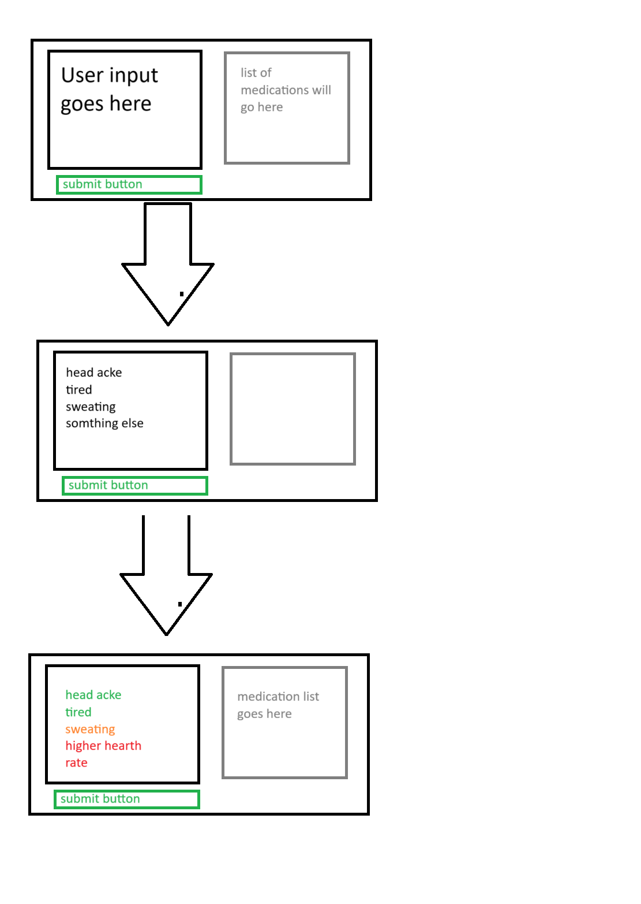

# Ted University
# Cmpe232 Project Proposal Abstrac
# By Efe Yörütken
## Project Summary
An application for producing, ideally, side effect free prescriptions. The user will provide their symptoms using a graphical interface.
Using a database of medications, positive effects, negative effects, which medication has which side effect and which medication has side effects the application
will produce a list of medications that when used together will minimize if not completely eliminate all side effects while solving the initial problems of the user.
This application is not ment to be a "self medication tool", but is a tool to help medical professionals and patients to figure out the best treatement.

## User Experience

### how to use
1. on one input field, the user will enter symptoms
    - unrecognized symptoms might or might not be indicated so that the user can use a another term
1. user will press the "submit" button
1. the application will do its best to come up with a "medication list" that solves all the problems of the patient with as little net side effects as possible
    - the solved problems will be colered green
    - unsolved problems will be colored orange
    - new symptoms, ie net side effects, will be colored red
