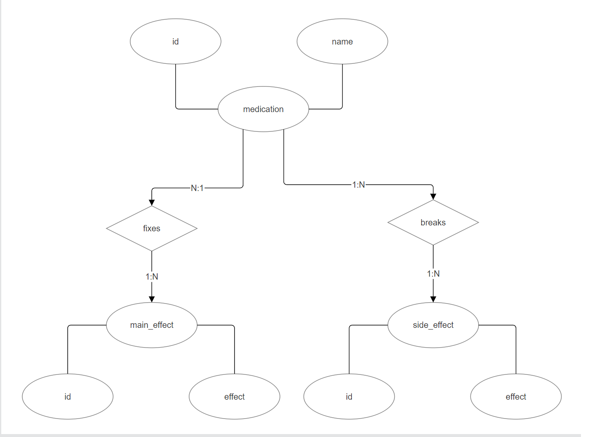
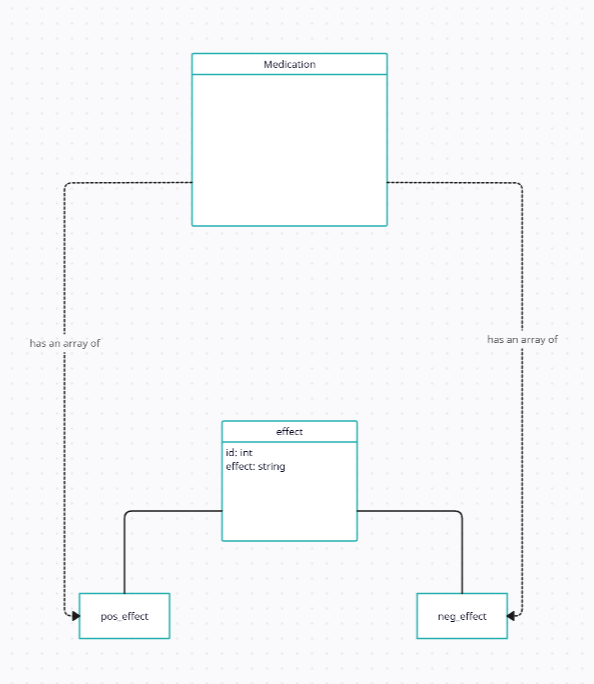

# TED University
# Cmpe232 Project Design Report
# By Efe Yörütken

## List Of Entities And Attributes
- has_effect
    - medication_id int
    - effect_id int
- has_side_effect
    - medication_id int
    - negative_id int
- medication
    - med_id int
    - name varchar(20)
- neg_effect
    - neg_id int
    - side_effect varchar(20)
- pos_effect
    - pos_id int
    - fixes varchar(20)

### ER-Diagram

## Class Diagram

